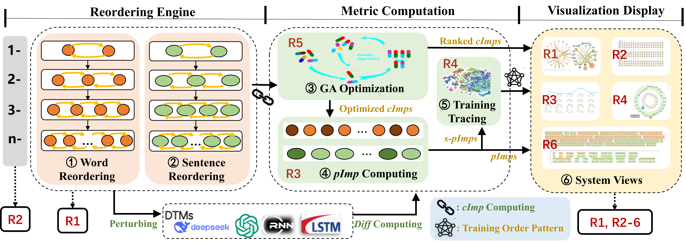
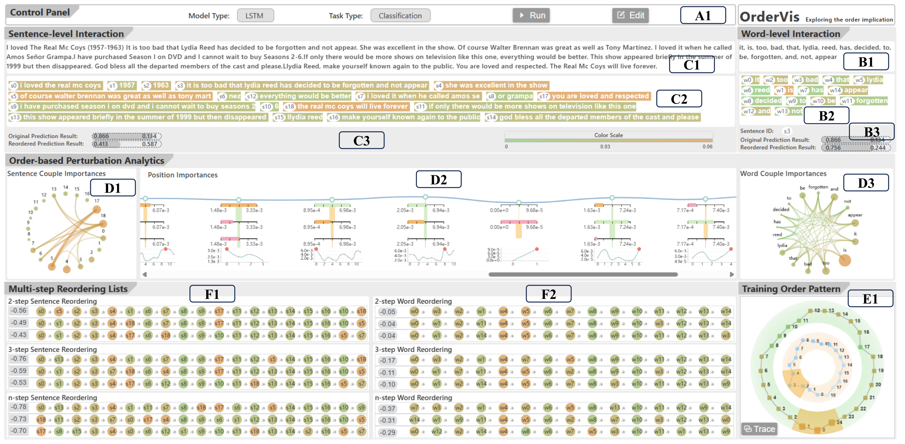
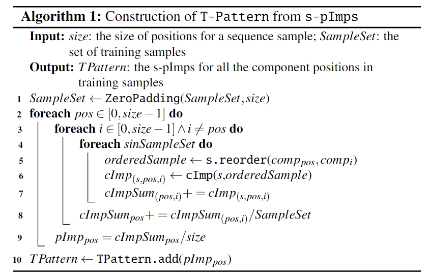
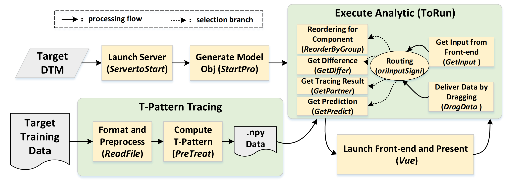

# OrderVis: Visual Analytics for Order-Based Text Adversarial Attacks
[TOC]

## Abstract

Text adversarial attacks have been widely employed to assess and understand the security of deep temporal models in the field of Natural Language Processing (NLP). Given the black-box nature of these models, traditional adversarial attacks predominantly focus on transformations related to word content, such as word substitution, deletion, and insertion, without addressing the potential impact of word order on the model's adversarial performance. This oversight, coupled with challenges such as unclear feature representation, complex perturbation operations, and indistinct training mapping, has prevented a systematic understanding of how the order of text influences model predictions.

To address these challenges, we propose OrderVis, a visual and interactive analysis framework that provides a comprehensive interpretation for the text order's impact in the predictions of deep temporal models. By quantitatively measuring prediction differences, OrderVis enables targeted reordering perturbations of text inputs, applicable both during testing and training phases of NLP adversarial attacks.

In order to clearly capture the impact of text order, OrderVis extracts reordering implications at two textual levels: individual words and sentence components. At each level, an intelligent search algorithm is used to accelerate reordering computations and optimize perturbation operations. Additionally, to support the construction of adversarial training samples, OrderVis traces the temporal model's order-related learning process by mapping structured input orders to training samples and extracting meaningful order patterns. 

To enable comprehensive analysis, OrderVis offers a variety of distinct views, including the multi-level interaction view, order-based perturbation analytics view, multi-step reordering view, and training order pattern view.

The effectiveness of OrderVis is evaluated on public NLP datasets through comprehensive case study, demonstrating that users can successfully manipulate prediction results with only minor order perturbations, applicable to both classic deep temporal models and advanced large language models. Furthermore, in-depth training pattern tracing show that OrderVis not only offers visual and quantitative interpretation for the order sensitivity, but also facilitates order-based adversarial sample generation for the improvement of model robustness. 

## OrderVis

### System Overview

|  Fig. 1: Workflow of *OrderVis*  |
| :------------------------------: |
|  |

To address the identified design requirements, this work proposes and implements *OrderVis*, a visual and interactive system for analyzing order-based text adversarial attacks. The overall workflow of OrderVis is demonstrated as Fig. 1, which is composed of three progressive modules: reordering engine, metric computation, and visualization display.The *reordering engine* is responsible for simulating reordering operations at both the word level (①) and sentence (②) level (**R1**), across different perturbation magnitudes (e.g., *1-*, *2-*, *3-*, or *n-*step reordering) (**R2**). These reordered inputs are then fed into the target DTMs alongside the original text.The output of the DTMs is compared with the original, unperturbed predictions to compute differences (*Diff Computing*). The pairwise difference results across numerous input variations are aggregated into *couple importances* (*cImps*), which serve as raw input for the *metric computation* module.In the metric computation, a genetic algorithm (GA)-based optimization (③) is applied to refine the *cImps* (**R5**). The optimized *cImps* are then used in two ways: to generate *ranked cImps* for further display and to compute *position importances* (*pImps*) (④) (**R3**).The sentence-level components of the computed *pImps* (*s-pImps*) are further used for *training tracing*(⑤) to extract *training order patterns* (**R4**).Finally, the ranked *cImps*, *pImps*, and training order patterns serve as the fundamental data sources for the *visualization display* module, which is responsible for designing the system views (⑥) (***R6***) and rendering the final results.

### Visualization Design

|  Fig. 2: Overview of *OrderVis*  |
| :------------------------------: |
|  |

We designed six distinct views in OrderVis to systematically analyze the Order-based Text Adversarial Attacks (O-TAA): (A) Control Panel, (B) Word-level Interaction View, (C) Sentence-level Interaction View, (D) Order-based Perturbation Analytics, (E) Training Order Pattern View, and (F) Multiple-step Reordering Lists, as shown in Fig. 2.

#### Control Panel

The **Control Panel** (Fig. 2-A) is designed to facilitate system-level configuration for O-TAA analysis, including the selection of the *target DTM* and *task type*. Currently, OrderVis supports five representative types of DTMs (i.e., RNN, LSTM, GRU, GPT, and DeepSeek), as well as two quantifiable prediction tasks (i.e., classification and regression). The supported DTMs cover both traditional deep learning architectures and state-of-the-art LLMs, thereby addressing the generalization requirement outlined in **R6**.

#### Word-level Interaction View

The **Word-level Interaction View** (Fig. 2-B) is designed to support both interactive user-driven order perturbations.
The **interactive panel** (Fig.2-B2) allows users to perform arbitrary reordering operations at the word level. Users first select a sub-sentence from the input text, and the text words of the sub-sentence are correspondingly displayed in the **original word sequence panel** (Fig.2-B1).
Then users can drag any word within the panel to a new position to execute a single-reordering. The system immediately computes the *couple importance* (i.e., *w-cImp*) resulting from this reordering, and users can view and analyze the corresponding *w-cImp* outcome in Fig.2-B3. This feature directly addresses the user interaction requirement outlined in **R6**.

#### Sentence-level Interaction View

In parallel with the *Word-level Interaction View*, the **Sentence-level Interaction View** (Fig.2-C) is developed to facilitate user-initiated reordering at the sentence level (Fig.2-C2). Such hierarchical design, extending from word-level to sentence-level interaction, is motivated by the requirement stated in **R1**, which highlights the importance of providing interpretable order-based perturbations and enabling fine-grained control.
Within the **original input sequence** panel (Fig.2-C1), users can freely reorder sub-sentences using the interactive interface (Fig.2-C2). A simple drag-and-drop operation allows users to move any sub-sentence to a new position, initiating a single-step reordering. The system then immediately calculates the corresponding couple importance (*s-cImp*), and the results of this perturbation can be reviewed and explored in Fig.2-C3. Such interactive capability aligns with the user interaction need discussed in **R6**.

#### Order-based Perturbation Analytic View

The **Order-based Perturbation Analytics** module serves as the core component of OrderVis, responsible for conducting a comprehensive analysis of order implications on the target input sequence. The analysis is carried out from two complementary perspectives: *couple importance* and *position importance*, with separate consideration for both the word level and sentence level.

**Couple Importance Analytic.** To facilitate the interpretation of multi-level couple importance, OrderVis presents two *circular Sankey diagrams* (Fig. 2-D1 for sentence level and Fig. 2-D3 for word level), providing clear visualizations of the most influential reorderings and their impacts. In detial, Fig.2-D1 uses a *circular Sankey diagram* to visualize the top-ranked *s-cImps* along with their corresponding reordered sub-sentence pairs. This helps users better understand and analyze the effects of sentence-level order perturbations on the input sequence, addressing the need to focus on single-step reordering, as specified in **R2**. Furthermore, the size and color of each connecting band in Fig.2-D1 reflect its quantitative value of corresponding couple importance, offering users a more intuitive and accessible explanation. As the counterpart to Fig.2-D1, Fig.2-D3 adopts a similar view design and functional implementation, with the distinction that it focuses on *word-level cImp* analysis.

**Position Importance Analytic.** To support a more generalized, pattern-oriented analysis of order sensitivity corresponding to the demand of **R3**, while de-emphasizing the specifics of the input text, OrderVis also provides a **Position Importance View**, as illustrated in Fig.2-D2. This view still adopts a hierarchical visualization design. In the top layer, a smooth curve connects the *sentence-level position importances* (*s-pImps*) across the input text sequence, where each node on the curve represents a sub-sentence position. The height of each node reflects its corresponding *s-pImp* value.
Embedded within each node is a vertical coordinate axis displaying a bar chart of the *word-level position importances* (*w-pImps*) for that sub-sentence. Additionally, at the bottom of each node, a *global map curve* visualizes the distribution of *w-pImps* within the sub-sentence. This design provides users with a more intuitive and fine-grained understanding of the overall position importance distribution throughout the input text.

#### Training Order Pattern View

To clearly illustrate the impact of order implication during model training and identify key points of order weakness for generating order-based adversarial samples, OrderVis provides a dedicated **Training Order Pattern** (*T-Pattern*) (E). This view also facilitates the tracing of underlying order-related correlations between test samples and training data. It directly corresponds to the requirement outlined in **R4**, which emphasizes the construction and tracing of training patterns.

This view is composed of two concentric polyline rings, where each node on the polylines represents the *s-pImp* value at a corresponding position. The farther a node is from the center, the larger its *s-pImp* value, indicating a higher sensitivity to order-based perturbations.The *outer polyline* visualizes the *T-Pattern*, a sequence of position-wise *s-pImp* values computed from the training dataset using Algorithm in Fig. 3. This sequence helps users identify positions in the training data that are more vulnerable to order perturbations. The *inner polyline* represents the *s-pImp* sequence of the currently analyzed input text, allowing it (the frame at inner ring) to be directly compared and mapped to the outer training pattern (the frame at outer ring). This mapping facilitates the generation of order-based adversarial training samples by aligning sensitive positions in the current input with known order weaknesses in the training data. In detail, users can select a specific region of the inner sequence and click the *Trace* button. OrderVis will then trace the selected region to the most similar sub-sequence within the outer *T-Pattern*. This mapping provides actionable insight for the targeted transformation of the input sample, enabling the user to generate order-based adversarial training samples that can be used to improve the robustness of the target DTM.

| Fig. 3 Algorithm1: Construction of T-Pattern from s-pImps |
| :-------------------------------------------------------: |
|                         |

#### Multiple-step Reordering Lists

To enable comprehensive comparative analysis of order-based perturbations, OrderVis includes the **Multi-step Reordering List View** (Fig.2-F), displaying the top-3 most impactful reordering results (based on *cImp* values) for **2-**step, **3-**step, and **n-**step operations. Consistent with other views, this is organized into two levels: sentence reordering (Fig.2-F1) and word reordering (Fig.2-F2), each sorted separately. This design aligns with **R2**, emphasizing the need for multi-step perturbations in order to provide a more comprehensive comparison of adversarial impacts. Since multi-step perturbations are more likely to alter semantics and are generally less subtle than single-step reordering, we focus on the *top-3* perturbations with the highest *cImp* values. Additionally, as these perturbations often affect multiple parts of the input sequence, the view displays the entire reordered sequence for complete context. To aid comparison, the corresponding *cImp* value is displayed at the start of each sequence, enabling users to easily identify and analyze the most impactful perturbations across different granularities.

#### Implementation

The popular deep learning library *TensorFlow* is used to build the learning models on the server side of the system, integrated with *Flask* for communication with the web front end. The web interface is developed using *Vue.js*. To enhance visual presentation and aesthetics, we incorporate *vuedraggable* and *Element UI* for layout organization, and utilize *ECharts.js* to render various types of visualizations.
Furthermore, to meet the generalization requirement outlined in **R6**, we have developed a flexible and extensible framework compatible with custom DTMs and provides corresponding usage interfaces{https://github.com/an-luckydog/OrderVis}. This allows users to easily build their own OrderVis system and analyze order-based interpretability for specific tasks. With encapsulating the target model into a class, users can pass a model pointer into OrderVis and generate a model object for the order implication analysis.

## Usage

This system includes two parts: browser side and machine learning side. The machine learning side calculates interpretable information of DTM set by researchers based on users' input, as well as predicted value of input after reordering by end-users. The machine learning side can be run directly and offers partial interpretability.   
The code is available under machine learning branch: https://github.com/505025234/OrderVis/tree/machine-learning-side .

While the browser side is responsible for visualization and interaction. It will work with the machine learning side and improve interpretability greatly.   
The code is available under browser side branch https://github.com/505025234/OrderVis/tree/browser-side

  `If you need to use our system, please run the browser side and machine learning side on the same or two machines.` 

  `If you just want to check efficiency of the system, please visit http://52.82.121.31:81/ and use examples we have provided.`

### Critical Interface

  - 1.The researchers need to import target model in interface StartPro, and run the machine learning side through this interface.  
  - 2.While the program is running, the machine learning side will call interface oriInputSigni to calculate interpretable information of DTM.  
  - 3.Interface getPredict is set to provide end-users with predicted values of reordered inputs.  
  - 4.If you want to use our system to trace training data, it is essential to pre-processing your data. You should use interface ReadFile to import your model and read your data into cash. Details of usage will be shown in maching learning branch.  
    

### Main function

#### Machine learning side (back-end)

  - 1.ReadFile and PreTreat are used to pre-process training data. (Pre-processing is not necessary. However, if you want to trace your training data, it must be done before establishing a server on the machine learning side.)  
  - 2.ServertoStart and StartPro are used to import model which will be interpreted.  
  - 3.ReorderByGroup is used to calculate local interpretability and glabal interpretability of model; GetDiffer is used to capture critical order line using Genetic Algorithm; GetPartner is used to trace training data(not available without pre-processing).  
  - 4.GetPredict is used to compute predictions for inputs that have been reordered by end-users.  

#### Browser side (front-side)

  - 1.GetInput will communicate with the machine learning side and call ReorderByGroup, GetDiffer, GetPartner. It will graphically display the interpretable information of the DTM.  
  - 2.DragData will be called and communicate with the machine learning side when end-users interact with the system by dragging components or tokens. DragData will display predicted values of reordered inputs.
    
